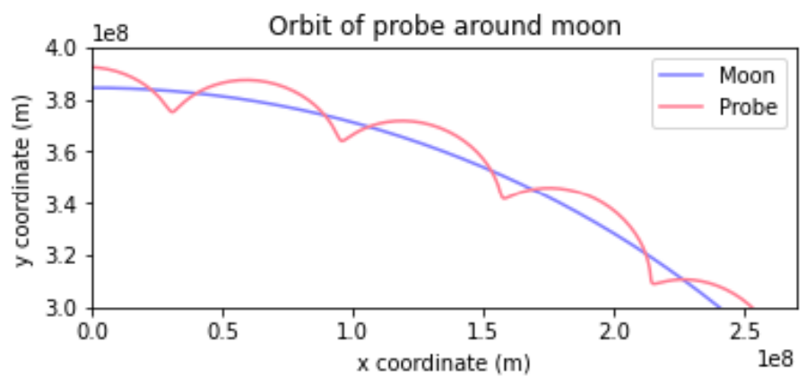

# lunar-probe-orbital-simulation
Simulating the orbital motion of a lunar probe under dual gravitational influence from the moon and earth.

# Simulating the Orbital Motion of a Lunar Probe Under Dual Gravitational Influence

This Python project models the motion of a lunar probe orbiting the Moon, while the Moon itself orbits the Earth. It simulates the system using Newtonian gravity and numerically integrates the resulting system of differential equations using `scipy`.

The simulation accounts for:
- Earth's gravity on the Moon
- Both Earth and Moon's gravity on the probe
- The conversion between the Moon's frame and Earth's frame
- Accuracy tuning via numerical tolerance

---

## Key Features

- Numerically solves equations of motion using `scipy.integrate.solve_ivp`
- Models a two-body (Earth–Moon) and three-body (Earth–Moon–Probe) system
- Plots the orbital paths of the Moon and the probe in 2D space
- Shows effect of varying probe altitude and initial velocities
- Achieves 99.44% accuracy compared to the Moon’s real orbital period
- Includes visual comparison of orbits at various solver tolerances

---

## Sample Output

> Probe orbiting the Moon while both orbit the Earth. Simulated in Python with `solve_ivp`.

---

## Theory Summary

The Moon is treated as orbiting the Earth, modeled as a fixed origin representing the centre of Earth's mass. The probe is influenced by gravitational forces from both the Earth and the Moon. The equations of motion are:

**Moon's motion**  
\[
\ddot{\vec{r}}_m = -\frac{GM_e}{|\vec{r}_m|^3} \vec{r}_m
\]

**Probe's motion**  
\[
\ddot{\vec{r}}_p = -\frac{GM_e}{|\vec{r}_p|^3} \vec{r}_p - \frac{GM_m}{|\vec{r}_{pm}|^3} \vec{r}_{pm}
\]

where:
- \( \vec{r}_m \): position vector of the Moon from Earth
- \( \vec{r}_p \): position vector of the probe from Earth
- \( \vec{r}_{pm} = \vec{r}_p - \vec{r}_m \): probe's position relative to the Moon

